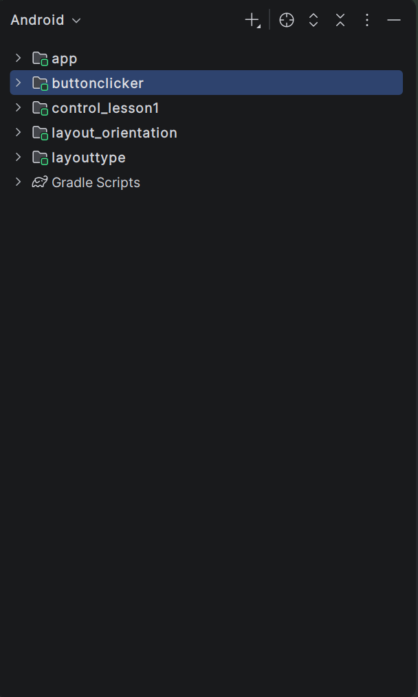
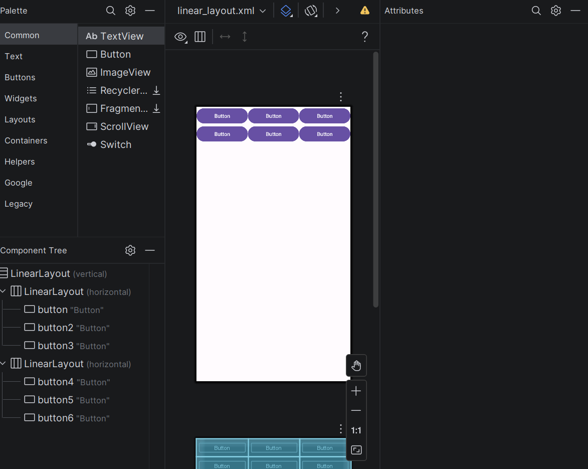
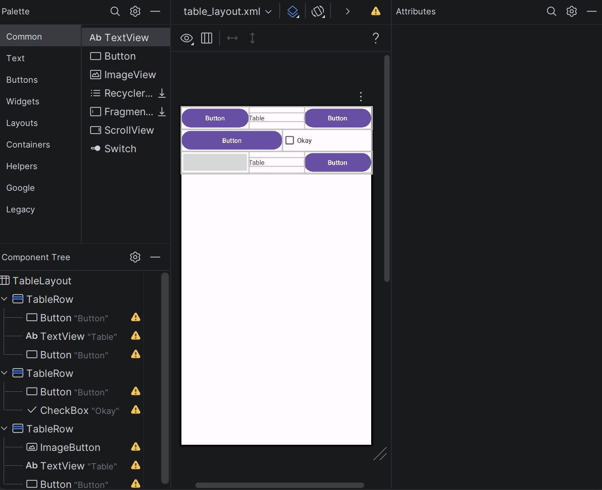
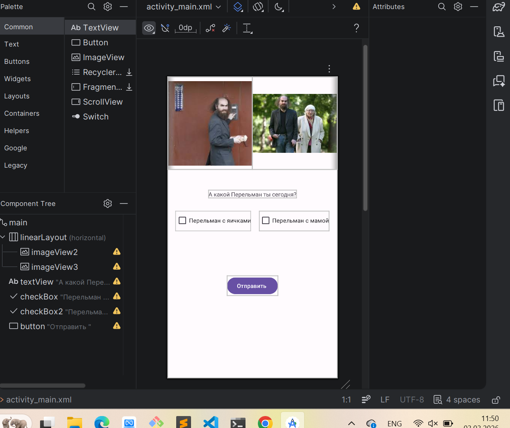
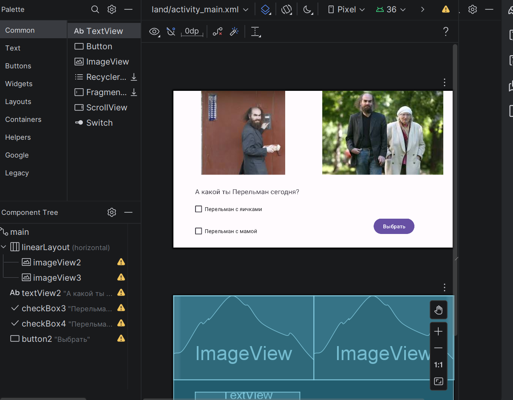
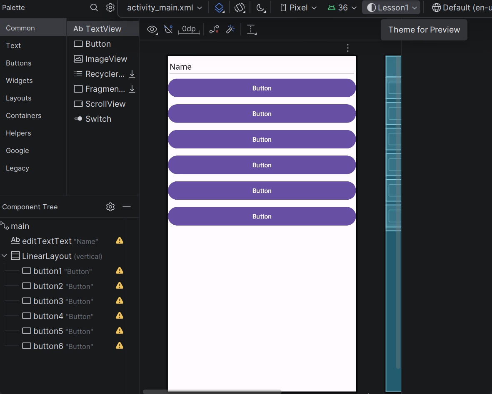
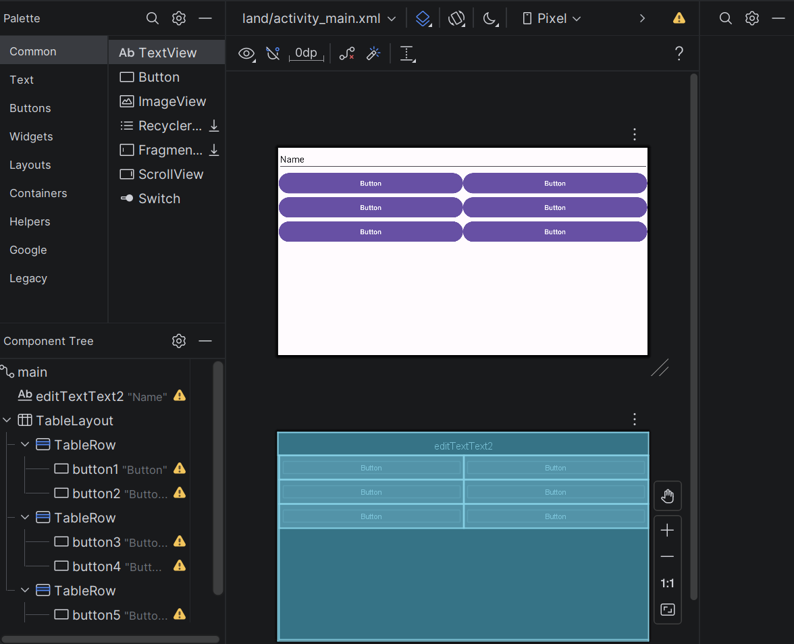
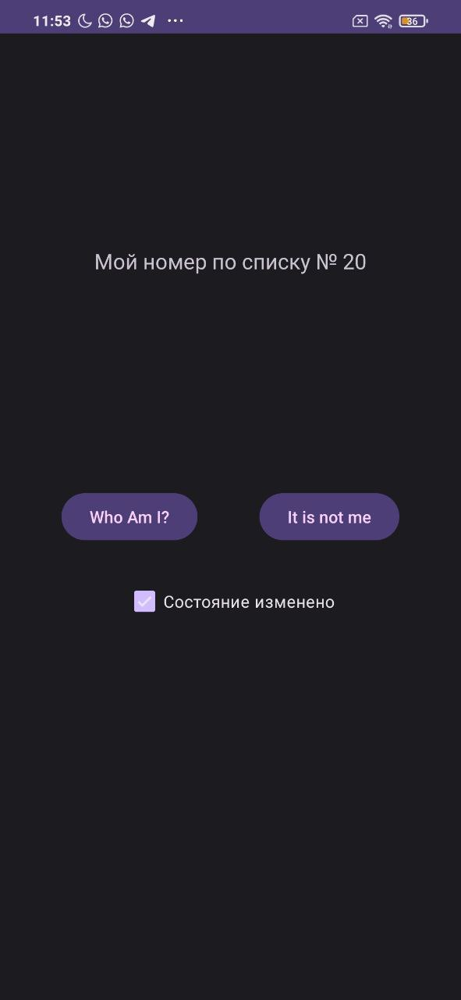

# ОТЧЕТ ПО ПРАКТИЧЕСКОМУ ЗАНЯТИЮ № 1

**Дисциплина:** Интеллектуальные мобильные приложения  
**Студент:** Каримов И. И.  
**Группа:** (Укажите вашу группу)  
**Университет:** РТУ МИРЭА  

---

## 1. Цель работы
Изучение основ работы в среде разработки Android Studio, освоение структуры Android-проекта, получение навыков верстки пользовательского интерфейса с использованием различных контейнеров компоновки и программного управления элементами экрана на языке Java.

## 2. Стек технологий
*   **Среда разработки:** Android Studio Ladybug 2024.2.2.
*   **Язык программирования:** Java.
*   **Минимальная поддерживаемая версия:** API 26 (Android 8.0).
*   **Система сборки:** Gradle.

## 3. Выполнение работы

### Глава 1-2. Настройка среды и создание структуры проекта
В рамках данных разделов была произведена установка и первичная конфигурация IDE Android Studio. Изучены системные требования и процесс установки необходимых компонентов SDK платформ (Android 15.0 и Android 8.0).
*   Создан проект в соответствии с учебной формой именования: `ru.mirea.ФамилияИО.lesson1`.
*   Изучена иерархия проекта: разделение на Модули и Проекты. Согласно методическим указаниям, в рамках одного практического занятия реализовано несколько модулей для каждого задания.
*   Определены основные параметры конфигурации: `Package name`, `Save location`, `Language` (Java) и `Minimum SDK` (API 26).

> 

### Глава 3-4. Проектирование пользовательского интерфейса
Рассмотрена структура `View` элементов. Изучен процесс формирования интерфейса в XML-файлах, расположенных в директории `res/layout`. 
*   **Изучены ключевые атрибуты элементов:** идентификаторы (`android:id`), параметры ширины и высоты (`match_parent`, `wrap_content`), а также использование относительных единиц измерения (`dp` для размеров и `sp` для текста).
*   **Отработаны основные типы контейнеров (ViewGroup):**
    1.  `LinearLayout`: организация элементов в одну строку или один столбец с использованием атрибута `orientation`.
    2.  `TableLayout`: построение интерфейса на основе строк (`TableRow`) и столбцов.
    3.  `ConstraintLayout`: создание гибких интерфейсов путем установления связей (constraints) между элементами.
*   Практически реализованы макеты `linear_layout.xml` и `table_layout.xml`.

> 
> 
> 
> 

### Глава 5. Реализация адаптивной верстки (Ориентация экрана)
Изучен механизм связи Java-класса Активити с XML-разметкой посредством метода `setContentView(int)`. 
*   Реализована поддержка различных конфигураций устройства. С помощью инструмента «Orientation for Preview» созданы альтернативные ресурсы для альбомной ориентации (Landscape).
*   Продемонстрировано размещение файлов разметки в специализированных директориях ресурсов (`layout` для портретной и `layout-land` для альбомной ориентации), что позволяет системе автоматически выбирать требуемый макет при повороте устройства.

> 
> 

### Глава 6-7. Программная обработка событий
Реализован программный доступ к UI-компонентам из Java-кода. 
*   Использован класс `R` для идентификации ресурсов и метод `findViewById` для получения ссылок на объекты `View`.
*   В модуле `ButtonClicker` реализованы два способа обработки событий нажатия на кнопку:
    1.  **Программный:** создание объекта `View.OnClickListener` и его регистрация через метод `setOnClickListener`.
    2.  **Декларативный:** использование атрибута `android:onClick` в XML-файле с последующим созданием соответствующего метода в классе Активити.
*   Отработаны методы изменения состояния элементов: `setText()` для `TextView` и `setChecked()` для `CheckBox`.

> 
> 

## 4. Выводы
В ходе выполнения практической работы были освоены базовые инструменты Android-разработки. Изучена структура проекта и назначение ключевых файлов. Получены навыки создания адаптивной разметки и реализации интерактивности приложения через обработчики событий. Все поставленные задачи выполнены в полном соответствии с методическими указаниями.
